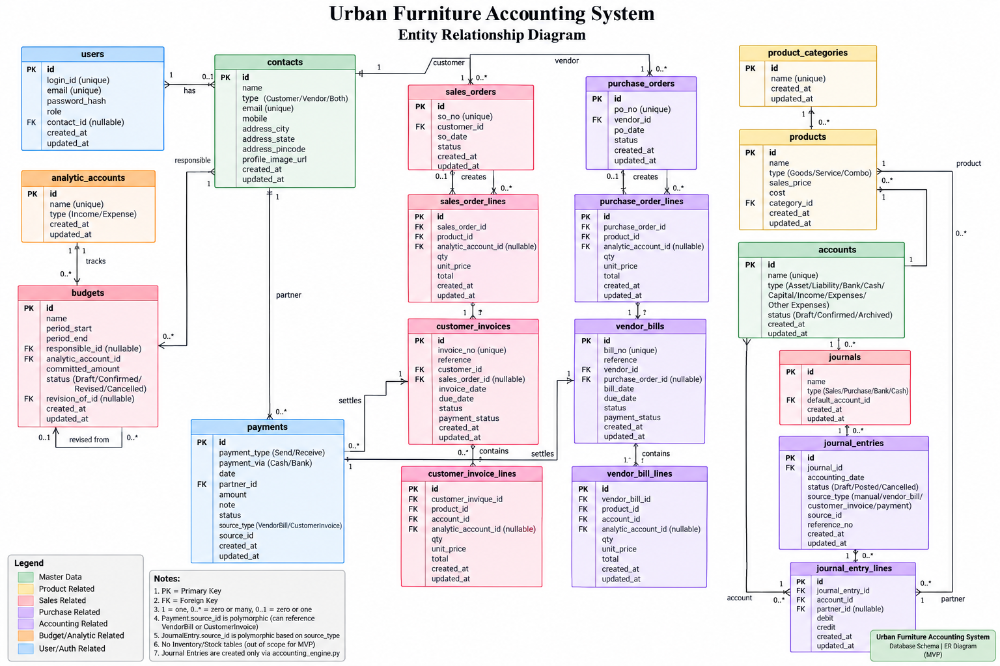

# Entity Relationship Diagram

This directory contains the Entity Relationship Diagram (ERD) for the
Urban Furniture Accounting System.

## ER Diagram

## Overview

The ER diagram represents the relationships between:

- Users and Contacts
- Contacts and business transactions
- Product Categories and Products
- Sales Orders and Sales Order Lines
- Purchase Orders and Purchase Order Lines
- Vendor Bills and Vendor Bill Lines
- Customer Invoices and Customer Invoice Lines
- Payments
- Accounts and Journals
- Journal Entries and Journal Entry Lines
- Analytic Accounts
- Budgets

The database schema is implemented using:

- PostgreSQL
- SQLAlchemy ORM models
- Alembic migrations